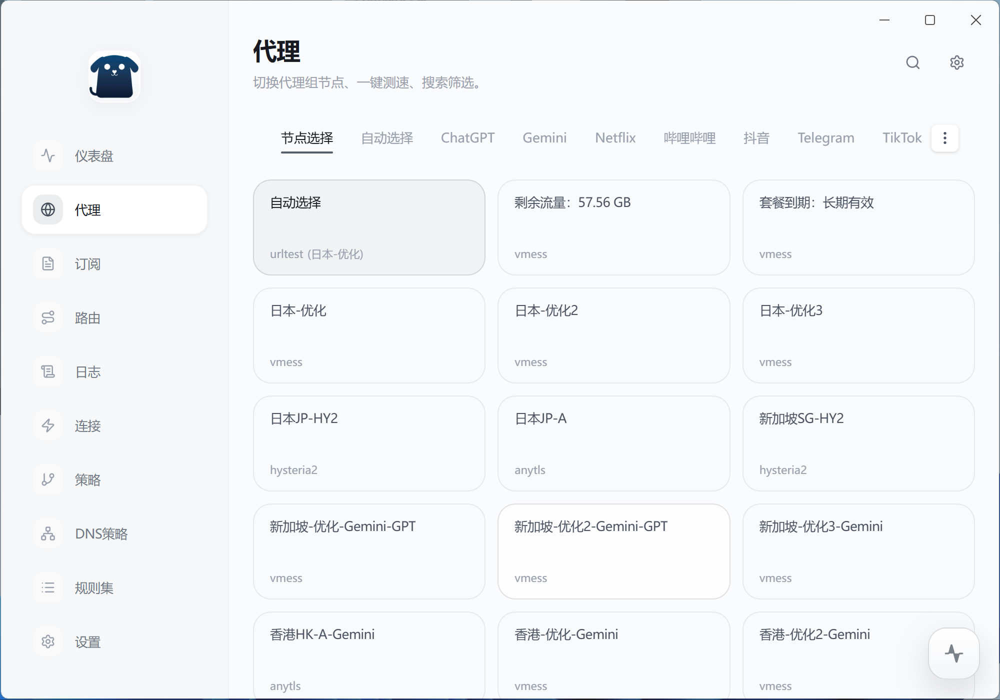
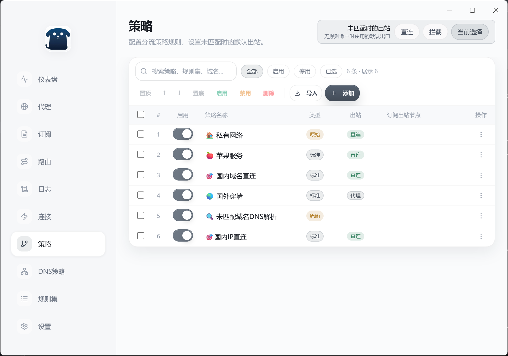

  

<h1 align="center">Rover</h1>

  <strong>🎨 Full Visual Configuration · 🌍 Cross-Platform · 🚀 Easy to Use</strong>

  <em>Next-generation sing-box GUI desktop client — WYSIWYG proxy configuration</em>

  
  
  
  

  
  
  

  <a href="#-highlights">Highlights</a> •
  <a href="#-installation">Installation</a> •
  <a href="#-screenshots">Screenshots</a> •
  <a href="#-quick-start">Quick Start</a> •
  <a href="./README_zh-CN.md">简体中文</a>

---

# 🌟 Highlights

## 📐 Full Visual Configuration

Say goodbye to tedious manual YAML/JSON editing! Rover provides a complete visual configuration interface:

### 🛤️ Visual Route Rule Editor
- **Graphical Rule Editor** — No need to memorize complex syntax, configure with mouse clicks
- **Full Rule Type Support** — domain, ip_cidr, port, process_name, src_ip_cidr, and more
- **Logical Rule Combination** — AND/OR logic support for complex routing needs
- **Real-time Preview** — Changes take effect instantly, what you see is what you get

### 🌐 Visual DNS Policy Management
- **Independent DNS Policy Configuration** — Assign dedicated DNS servers for different domains
- **Multi-protocol DNS Support** — UDP, TCP, DoT, DoH, DoQ, HTTP/3 all covered
- **Domain Rule Matching** — Keyword, suffix, regex, and wildcard domain matching
- **DNS Blocking** — One-click blocking of ads and tracking domains

### 📦 One-click Rule Set Management
- **Built-in Rule Sets** — Pre-installed geosite, geoip, ACL4SSR, Clash and other popular rule sets
- **Remote Subscription** — Support custom rule set URLs with auto-update
- **Local Editing** — Create and edit your own rule sets
- **Auto Format Conversion** — Smart binary/source format detection

---

## 🎯 Built-in Templates, One-click Traffic Splitting

Don't want to deal with configuration? Preset templates have you covered! Solve DNS leakage and DNS pollution with one click:

| Template | Description |
|----------|-------------|
| **China Whitelist + Global Proxy (Clash)** | Based on Clash rule sets, includes direct apps, private networks, ad blocking, Apple services, Google, Telegram, etc. |
| **China Whitelist + Global Proxy (ACL4SSR)** | Combines ACL4SSR + Geosite rules, covering Apple, Bilibili, China direct, global proxy, etc. |
| **🚀 Balanced Traffic Splitting** | Uses Aliyun UDP for fast China resolution, Google DoT + FakeIP for global — effectively solves DNS pollution |

**Select Template → One-click Apply → Done!** No manual configuration required.

---

## 🌍 Cross-Platform Support

| Platform | Support |
|----------|---------|
| Windows | ✅ NSIS installer, ready to use |
| macOS | ✅ Apple Silicon native support, Universal Binary |

Unified experience — no matter what system you use, the interface and features are completely consistent.

---

## 🚀 Easy to Use, Seamless Migration for Clash Users

If you're a Clash user, Rover feels familiar:

- **Familiar Rule Sets** — Built-in Clash Premium rule sets, reuse rules you already know
- **Subscription Compatibility** — Supports Clash subscription format, import existing configs with one click
- **Similar Operation Logic** — Node grouping, latency testing, mode switching — zero learning curve
- **More Powerful Features** — While keeping ease of use, unlock the full power of sing-box

---

# ✨ More Features

### 📊 Dashboard
- Real-time up/down traffic charts
- Node status and latency display
- One-click start/stop proxy core

### 🌍 Node Management
- Multi-group display (tab/list view)
- Node sorting (default/latency/name)
- Batch latency testing

### 📂 Subscription Management
- Remote subscription and local config support
- Auto subscription update
- Traffic usage information display

### 🔍 Connection Monitor
- Real-time connection list
- Connection detail tracking
- One-click close connections

### 📋 Log Viewer
- Multi-level log filtering
- Real-time refresh
- Smart config error hints

### ⚙️ System Settings
- Port configuration, LAN access
- IPv6 toggle, Hosts override
- Auto-start on boot, tray running

### 🔒 Protocol Support
Based on sing-box core, supports:
- **Shadowsocks**
- **VMess / VLESS** (with Reality)
- **Trojan**
- **Hysteria2 / TUIC**
- **AnyTLS** (sing-box 1.12.0+)
- HTTP/HTTPS/SOCKS5

---

# 📸 Screenshots

  

  

  

---

# ⚡ Installation

Download the latest version from the Releases page:

👉 https://github.com/roverlab/rover/releases

| OS | Format | Notes |
|----|--------|-------|
| Windows | `.exe` | NSIS installer |
| macOS | `.dmg` | Apple Silicon native support |

---

# 🚀 Quick Start

### 1️⃣ Download & Install
Download the installer for your platform from Releases and complete installation.

### 2️⃣ Import Configuration
Supports:
- **Subscription URL** — Paste subscription link, import with one click
- **Local File** — Import YAML/JSON config files
- **Manual Config** — Edit configuration directly

### 3️⃣ Select Template
Go to the "Policy" page, select a built-in template and apply it with one click to complete traffic splitting configuration.

### 4️⃣ Start Proxy
Select node → Click Start → Ready to go!

---

# 🔒 Secure & Transparent

- **Fully Open Source** — Public code, auditable and trustworthy
- **No Ads** — Clean experience, no distractions
- **No Data Collection** — Privacy first, your data belongs only to you

---

# 🤝 Contributing

Contributions are welcome!

- Submit an [Issue](https://github.com/roverlab/rover/issues) to report bugs or suggestions
- Open a Pull Request to contribute code
- Help improve documentation

---

# 📄 License

This project is open-sourced under the [MIT License](./LICENSE).

---

  Made with ❤️ by <a href="https://github.com/roverlab">RoverLab</a>

