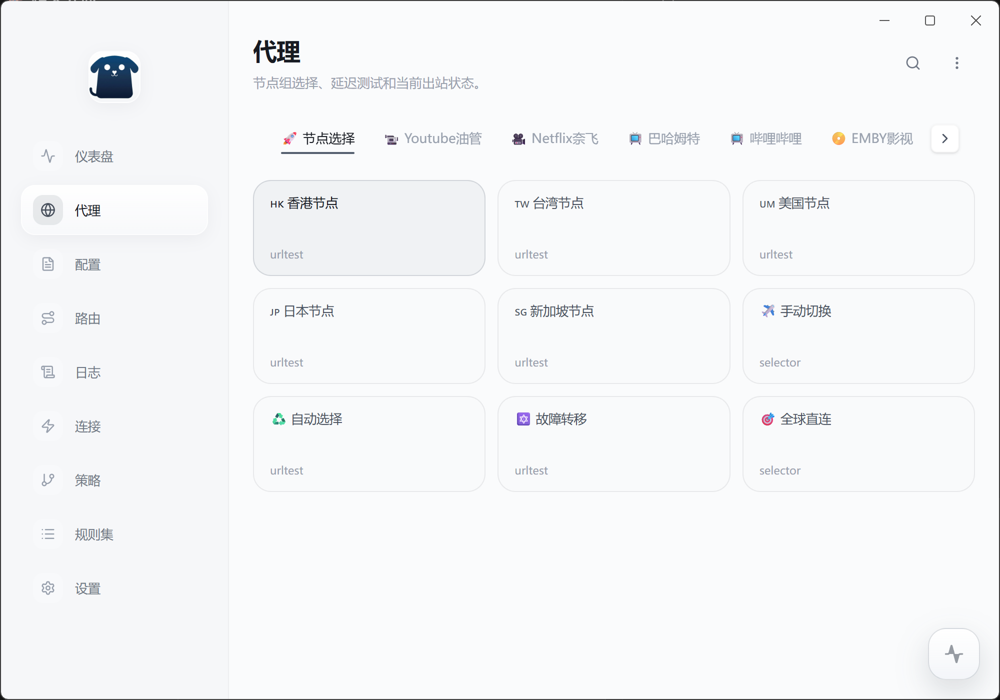

  

<h1 align="center">Rover</h1>

  <strong>🚀 Beautiful · Powerful · Free</strong>

  <em>The next-generation sing-box GUI desktop client, making proxying simpler and faster.</em>

  
  
  
  

  
  
  

  <a href="#-features">Features</a> •
  <a href="#-installation">Installation</a> •
  <a href="#-screenshots">Screenshots</a> •
  <a href="#-documentation">Documentation</a> •
  <a href="./README_zh-CN.md">简体中文</a>

---

# ✨ Features

### 🎨 Stunning Interface
- Glassmorphism UI design
- Auto-adaptive Dark / Light mode
- Smooth animations and modern design

### ⚡ Exceptionally Easy to Use
- Three-step installation
- One-click subscription import
- Automatic node speed testing

### 💪 Powerful Functionality
- Supports **SS / VMess / Trojan / Snell**
- Intelligent rule-based routing
- Real-time traffic monitoring

### 🔒 Secure & Transparent
- Fully **Open Source**
- No advertisements
- No data collection

---

# 📸 Screenshots

  

---

# ⚡ Installation

Download from the Releases page:

👉 https://github.com/roverlab/rover/releases

Supported Platforms:

| OS | Format |
|----|----|
| Windows | `.exe` |
| macOS | `.dmg` (Apple Silicon) |

---

# 🚀 Quick Start

### 1️⃣ Download Application
Grab the latest version from the Releases.

### 2️⃣ Import Configuration
Supports:
- Subscription URLs
- YAML
- JSON

### 3️⃣ Start Proxying
Test node speeds → Hit Start.

---

# 🔧 Functional Modules

| Module | Description |
|-----|-----|
| 📊 Dashboard | Real-time network speed monitoring |
| 🌍 Node Management | Grouping and sorting of nodes |
| 📂 Config Center | Subscription and file management |
| 🛡️ Rule System | Intelligent traffic splitting |
| 🔍 Connection Audit | Real-time request tracking |

---

# 🤝 Contributing

Contributions and suggestions are always welcome!

- Submit an Issue
- Open a Pull Request

---

  Made with ❤️ by <a href="https://github.com/roverlab">RoverLab</a>

