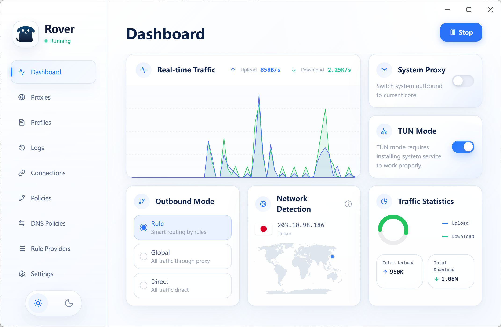

<div align="center">
  

  <h1>Rover</h1>
  <p><strong>Cliente GUI multiplataforma para sing-box · Una experiencia de configuración verdaderamente visual</strong></p>

<p>
  
  
  
  

  <a href="./README.md">English</a> | <a href="./README_zh-CN.md">简体中文</a> | <a href="./README_zh-TW.md">繁體中文</a> | <a href="./README_ja.md">日本語</a> | <a href="./README_ko.md">한국어</a> | <a href="./README_ru.md">Русский</a> | <a href="./README_fa.md">فارسی</a>
</p>

</div>

**Rover** es un cliente de escritorio moderno para sing-box que te libera de la tediosa escritura manual de configuraciones JSON y ofrece una verdadera experiencia de proxy **WYSIWYG** (lo que ves es lo que obtienes).

## ✨ Características principales

- 🎨 **Completamente visual**: Edición gráfica de **reglas de enrutamiento** y **DNS personalizado**, con soporte para múltiples protocolos y bloqueo de publicidad.
- 🛡️ **Modo TUN**: Soporte nativo para interfaces de red virtual TUN, permitiendo tomar el control del tráfico de todo el sistema con un solo clic.
- 🔄 **Compatibilidad total con Clash**: Totalmente compatible con suscripciones y conjuntos de reglas Clash / Mihomo, permitiendo una migración sin coste para los usuarios existentes.
- 📦 **Listo para usar**: Plantillas de enrutamiento clásicas integradas (por ejemplo, lista blanca nacional / modo global), eliminando configuraciones complejas.
- 📊 **Monitoreo en tiempo real**: Velocidades de subida/bajada, latencia de nodos y conexiones activas en tiempo real.

## 🌐 Protocolos soportados
`Shadowsocks` / `VMess` / `VLESS (Reality)` / `Trojan` / `Hysteria2` / `TUIC` / `AnyTLS` / `HTTP/SOCKS5`

## 📸 Capturas de pantalla

<div align="center">
  
</div>

## ⚡ Inicio rápido

1. **Descargar**: Visita [Releases](https://github.com/roverlab/rover/releases) para obtener las versiones de Windows / macOS / Linux.
2. **Importar**: Pega tu enlace de suscripción o importa un archivo local en la página "Perfiles".
3. **Conectar**: Aplica una plantilla integrada en la página "Políticas", luego habilita el proxy (o modo TUN) para comenzar.

## 🛠️ Desarrollo y compilación

```bash
npm install
npm run dev        # Iniciar desarrollo
npm run pack:win   # Compilar versión Windows
```

## 🤝 Contribuir

¡Tu contribución es bienvenida!
- 🐛 ¿Encontraste un bug? Envía un [Issue](https://github.com/roverlab/rover/issues)
- 💡 ¿Tienes ideas? Inicia una [Discusión](https://github.com/roverlab/rover/discussions)
- 🛠️ Antes de enviar un PR, asegúrate de que tu estilo de código sea coherente con la arquitectura existente.

**Agradecimientos especiales**: [Sing-Box](https://github.com/SagerNet/sing-box) | [Electron](https://www.electronjs.org/) | [React](https://react.dev/) | [Tailwind CSS](https://tailwindcss.com/) | [Rspack](https://rspack.dev/)

---

<div align="center">
  <p>Construido con ❤️ por <strong><a href="https://github.com/roverlab">RoverLab</a></strong></p>
  <p><em>Este proyecto es solo para fines de aprendizaje y comunicación. Por favor, cumpla con las leyes y regulaciones locales.</em></p>
</div>
